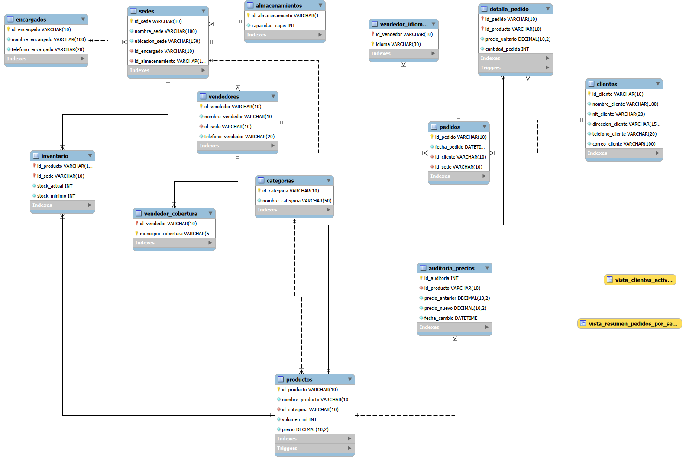

# Distribuidora de Gaseosas del Valle S.A.

es una empresa distribuidora autorizada de bebidas gaseosas en el municipio de Girón, con planes de expansión hacia Bucaramanga y Piedecuesta.

 Actualmente gestionan los pedidos y el control de stock en hojas de cálculo, lo cual ha generado errores de registro, pérdida de datos y falta de trazabilidad sobre las ventas.

La gerencia busca implementar una base de datos relacional en MySQL que permita administrar productos, clientes, pedidos y sedes de distribución, además de automatizar tareas críticas como el cálculo de totales, la verificación de stock y el registro de auditorías al cambiar precios.




# Sistema de Gestión de Bases de Datos - Distribuidora de Bebidas

Este repositorio contiene la arquitectura completa de base de datos relacional para la gestión operativa, logística y de ventas de **Distribuidora de Bebidas**. Incluye desde la etapa de diseño y normalización de datos hasta scripts SQL avanzados para automatización, vistas y consultas de negocio.

---

## Tecnologías y Herramientas

* **Motor de BBDD:** MySQL 
* **Diseño & Modelado:** Normalización (1FN, 2FN, 3FN)
* **Entorno de Desarrollo:** VS Code / MySQL Workbench
* **Control de Versiones:** Git & GitHub

---

##  Componentes del Sistema

### 1. Normalización de Datos (`/normalizacion`)
Análisis y estructuración del modelo conceptual y lógico hasta alcanzar la **Tercera Forma Normal (3FN)**, eliminando redundancias de información y asegurando la integridad referencial.

### 2. Esquema de Base de Datos - DDL (`/bases-de-datos/ddl`)
Definición formal de la estructura de tablas (`clientes`, `sedes`, `productos`, `pedidos`, etc.), definiendo tipos de datos, llaves primarias (`PRIMARY KEY`) y relaciones mediante llaves foráneas (`FOREIGN KEY`).

### 3. Carga de Datos - DML (`/bases-de-datos/dml`)
Poblamiento inicial mediante sentencias `INSERT` manuales, estableciendo registros reales para la validación de operaciones y consultas.

### 4. Consultas de Negocio - DQL (`/bases-de-datos/dql`)
Agrupación de scripts SQL para la extracción de métricas clave mediante operaciones avanzadas (`JOIN`, `GROUP BY`, `SUM`, `COUNT`).

### 5. Vistas de Datos (`/bases-de-datos/views`)
Objeto de apoyo para simplificar el acceso a reportes recurrentes:
* **`vista_resumen_pedidos_por_sede`**: Consolida la cantidad de pedidos registrados en cada sede de la empresa.
* **`vista_productos_bajo_stock`**: Filtra automáticamente los productos que han alcanzado o sobrepasado su nivel de stock mínimo.
* **`vista_clientes_activos`**: Muestra el listado de clientes con un historial de compras registrado.

### 6. Automatización (`/triggers` y `/events`)
* **Triggers:** Control automatizado para validaciones e inventario.
* **Events:** Programación de tareas administrativas automatizadas en la base de datos.

---

## Instrucciones para Clonar e Instalar

1. **Clonar el repositorio:**
   ```bash
   git clone url del repositorio
   cd distribuidora_gaseosas

##  Estructura del Proyecto

El proyecto está organizado de manera modular para garantizar un mantenimiento limpio y escalable:

```text
.
├── bases-de-datos/
│   ├── ddl/
│   │   └── schema.sql         # Creación de tablas, claves primarias, foráneas y restricciones.
│   ├── dml/
│   │   └── insert.sql         # Inserción manual de datos de prueba y catálogos base.
│   ├── dql/
│   │   └── consultas.sql      # Consultas de análisis, reportes y operaciones frecuentes.
│   ├── events/
│   │   └── eventos.sql        # Eventos programados del servidor para tareas periódicas.
│   ├── evidencia/             # Capturas de pantalla y evidencias de ejecución.
│   ├── triggers/              # Disparadores para auditoría e inventarios.
│   └── views/
│       ├── image.png          # Capturas de resultados de vistas.
│       ├── image-1.png        
│       ├── vistas.sql         # Scripts SQL de creación de vistas.
│       └── vistas.md          # Documentación detallada de las vistas creadas.
├── normalizacion/
│   ├── Distribuidora...pdf    # Documento en PDF con la propuesta de normalización.
│   ├── Distribuidora...xlsx   # Matriz y tablas en Excel.
│   ├── image.png - image-5.png# Diagramas y capturas del proceso de normalización.
│   └── normalizacion.md       # Explicación del paso a paso (1FN, 2FN, 3FN).
├── .gitignore
└── README.md                  # Documentación principal del proyecto.

---

## Autor:

Sergio Ricardo Ajù Miranda
