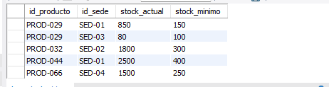
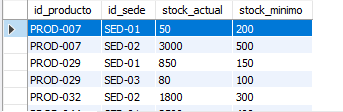
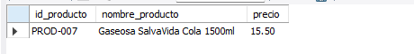
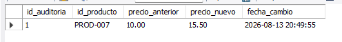

## primer trigger

tr_actualizar_stock

 Al insertar un detalle de pedido, descuenta automáticamente la cantidad vendida del stock.

SELECT * FROM inventario;

SELECT id_producto, id_sede, stock_actual
FROM inventario
WHERE id_producto = 'PROD-007' AND id_sede = 'SED-01';

SELECT * FROM inventario;

## segundo trigger

tr_auditar_cambio_precio

 Al actualizar el campo precio en la tabla productos, registra la fecha, el precio anterior y el nuevo en una tabla auditoria_precios.

 SELECT * FROM auditoria_precios;

 tenia un valor de 10 quetzales que puse por defecto

 

SELECT id_producto, nombre_producto, precio 
FROM productos 
WHERE id_producto = 'PROD-007';

UPDATE productos 
SET precio = 15.50 
WHERE id_producto = 'PROD-007';

SELECT * FROM auditoria_precios;

