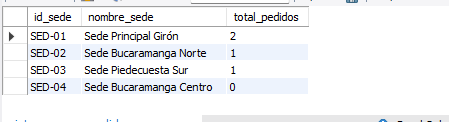
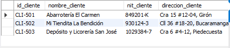

## las 3 vistas
-- 1. Vista: Resumen de pedidos por sede
CREATE OR REPLACE VIEW vista_resumen_pedidos_por_sede AS
SELECT 
    s.id_sede,
    s.nombre_sede,
    COUNT(p.id_pedido) AS total_pedidos
FROM sedes s
LEFT JOIN pedidos p ON s.id_sede = p.id_sede
GROUP BY s.id_sede, s.nombre_sede;

SELECT * FROM vista_resumen_pedidos_por_sede;

-- 3. Vista: Clientes activos
CREATE OR REPLACE VIEW vista_clientes_activos AS
SELECT DISTINCT
    c.id_cliente,
    c.nombre_cliente,
    c.nit_cliente,
    c.direccion_cliente,
    c.telefono_cliente
FROM clientes c
INNER JOIN pedidos p ON c.id_cliente = p.id_cliente;

SELECT * FROM vista_clientes_activos;

