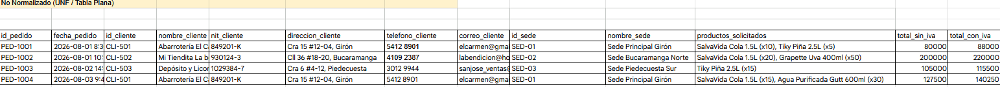
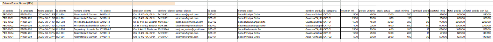
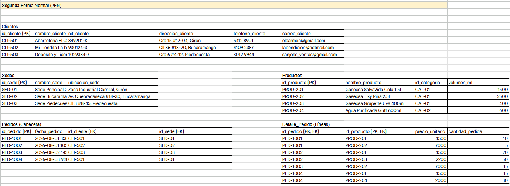
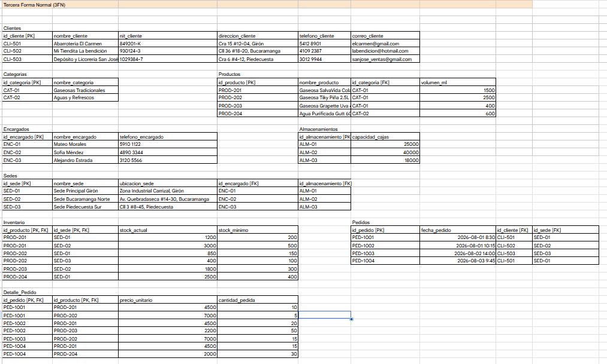
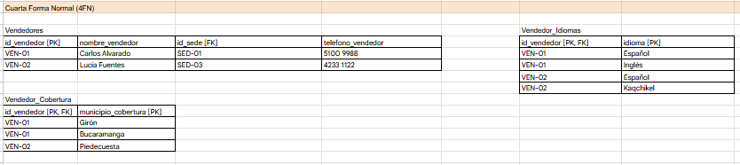

# Proceso de Normalización de Base de Datos
**Proyecto:** Distribuidora de Gaseosas del Valle S.A.  
**Origen de Datos:** Hoja de Cálculo de Google Sheets (`Distribuidora de Gaseosas del Valle S.A..csv`)

---

## Descripción General

El objetivo de este proceso fue transformar un conjunto de datos plano e desestructurado (almacenado originalmente en Google Sheets) en un modelo relacional robusto, eficiente y sin redundancias, cumpliendo estrictamente hasta la **Cuarta Forma Normal (4FN)**.

---

## Estado Inicial: Forma No Normalizada (UNF)

En la hoja de cálculo inicial, toda la información operativa (clientes, productos, sedes, pedidos, stock, encargados, idiomas y coberturas) se encontraba concentrada en una sola tabla plana.

## Etapas de Normalización

### 1. Primera Forma Normal (1FN)
* **Objetivo:** Garantizar la atomicidad de los datos y eliminar valores repetidos o listas dentro de los campos.

---

### 2. Segunda Forma Normal (2FN)
* **Objetivo:** Eliminar dependencias parciales (ningún atributo no clave debe depender solo de una parte de una clave primaria compuesta).
* **Acciones:**
  * Se separaron las entidades independientes de la tabla principal de transacciones:
    * `productos`
    * `clientes`
    * `sedes`
    * `pedidos`
  * Se creó la tabla puente **`detalle_pedido`** con clave primaria compuesta (`id_pedido`, `id_producto`), garantizando que la cantidad pedida y el precio unitario dependan de la combinación de ambos campos.
  * Se separó el control de inventarios en la tabla **`inventario`** con clave compuesta (`id_producto`, `id_sede`).

  

---

### 3. Tercera Forma Normal (3FN)
* **Objetivo:** Eliminar dependencias transitivas (ningún atributo no clave debe depender de otro atributo no clave).
* **Acciones:**
  * **Categorías:** El nombre de la categoría dependía funcionalmente del producto. Se extrajo la tabla **`categorias`** (`id_categoria`, `nombre_categoria`).
  * **Encargados de Sede:** Los datos del encargado dependían de la sede. Se aisló la tabla **`encargados`** (`id_encargado`, `nombre_encargado`, `telefono_encargado`).
  * **Almacenamiento:** La capacidad de cajas se independizó en la tabla **`almacenamientos`** (`id_almacenamiento`, `capacidad_cajas`).
  * **Campos Calculados:** Se eliminaron los campos redundantes `subtotal`, `total_sin_iva` y `total_con_iva` de los registros persistentes, ya que su valor se calcula dinámicamente mediante consultas SQL con agregación (`SUM`, `GROUP BY`).

  

---

### 4. Cuarta Forma Normal (4FN)
* **Objetivo:** Eliminar dependencias multivaluadas independientes.
* **Acciones:**
  * Un vendedor puede hablar múltiples idiomas y cubrir múltiples municipios de forma independiente.
  * Se descompuso la entidad `vendedores` separando estas dependencias multivaluadas en dos tablas relacionales con claves primarias compuestas:
    1. **`vendedor_idiomas`** (`id_vendedor`, `idioma`)
    2. **`vendedor_cobertura`** (`id_vendedor`, `municipio_cobertura`)

---

## Esquema Relacional Resultante

El modelo final consta de **12 tablas relacionales** conectadas mediante Claves Foráneas (`FOREIGN KEY`) con integridad referencial garantizada:

1. `categorias`
2. `productos`
3. `clientes`
4. `encargados`
5. `almacenamientos`
6. `sedes`
7. `inventario`
8. `pedidos`
9. `detalle_pedido`
10. `vendedores`
11. `vendedor_idiomas`
12. `vendedor_cobertura`

---
